# USER FLOW — App HKD (Zalo Mini App)

> Phụ lục của `SPEC-App-HKD.md` v0.5. Mọi sơ đồ viết bằng Mermaid.
> Ngày: 30/08/2026

---

## 1. Bản đồ điều hướng

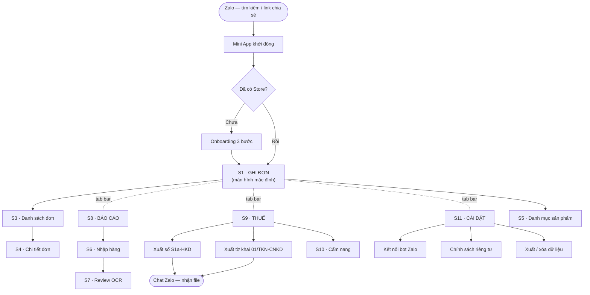

---

## 2. F0 — Onboarding lần đầu

Mục tiêu: **ghi được đơn đầu tiên trong 60 giây**.

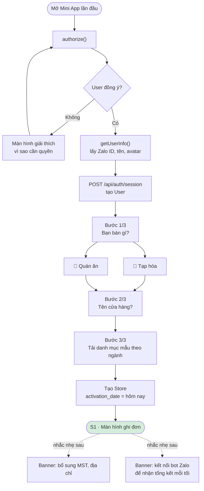

**Điểm quan trọng:** MST, địa chỉ, `getPhoneNumber`, kết nối bot đều **không hỏi lúc onboarding**. `getPhoneNumber` chỉ xin đúng lúc user bấm xuất tờ khai.

---

## 3. F3.1 — Ghi đơn nhanh (có xử lý mạng)

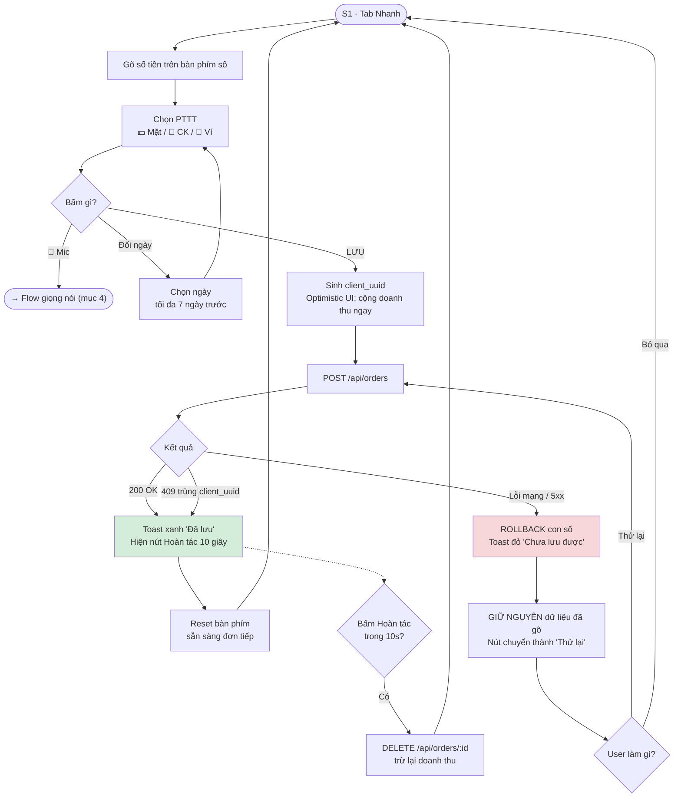

---

## 4. F3.2 — Ghi đơn bằng giọng nói ⭐

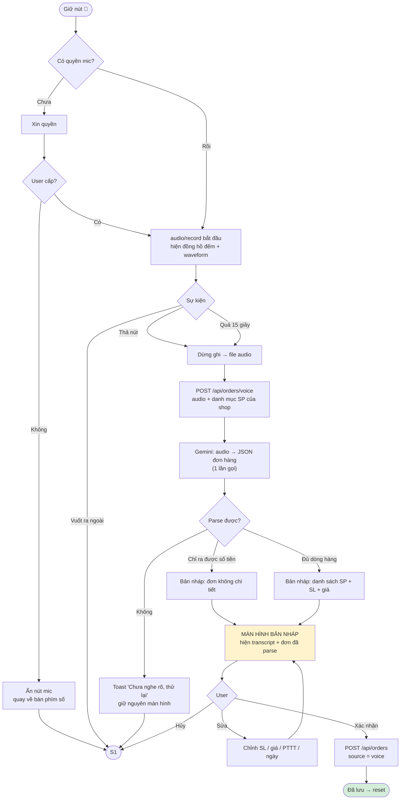

**Nguyên tắc bất di bất dịch:** giọng nói **không bao giờ** tự lưu thẳng. Luôn qua bản nháp.

**Ví dụ parse:**

| Câu nói | Kết quả |
|---|---|
| "Hai chai nước mắm Nam Ngư ba lăm nghìn một chai" | 2 × Nước mắm Nam Ngư @35.000 |
| "Một trăm hai mươi nghìn" | Đơn không chi tiết, 120.000 |
| "Ba tô bún bò hai cà phê sữa đá chuyển khoản" | 3 × Bún bò + 2 × Cà phê sữa đá, CK |
| "Hôm qua bán được năm trăm nghìn" | Đơn hôm qua, 500.000 |

---

## 5. F3.1b — Ghi đơn chế độ Chi tiết

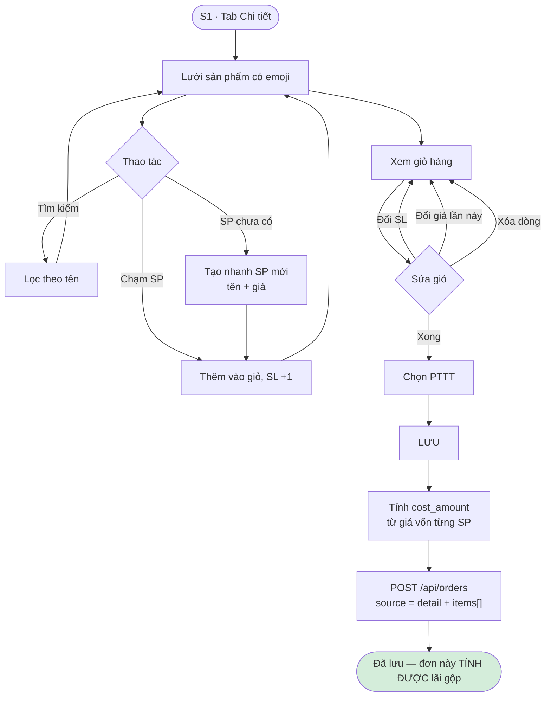

> Chỉ đơn ở chế độ Chi tiết mới tính được lãi gộp. Đơn Nhanh chỉ có doanh thu.

---

## 6. F2 — Nhập hàng bằng OCR hóa đơn

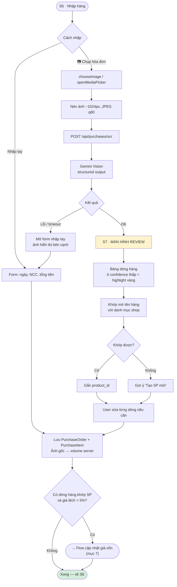

---

## 7. F1 — Cập nhật giá vốn từ phiếu nhập

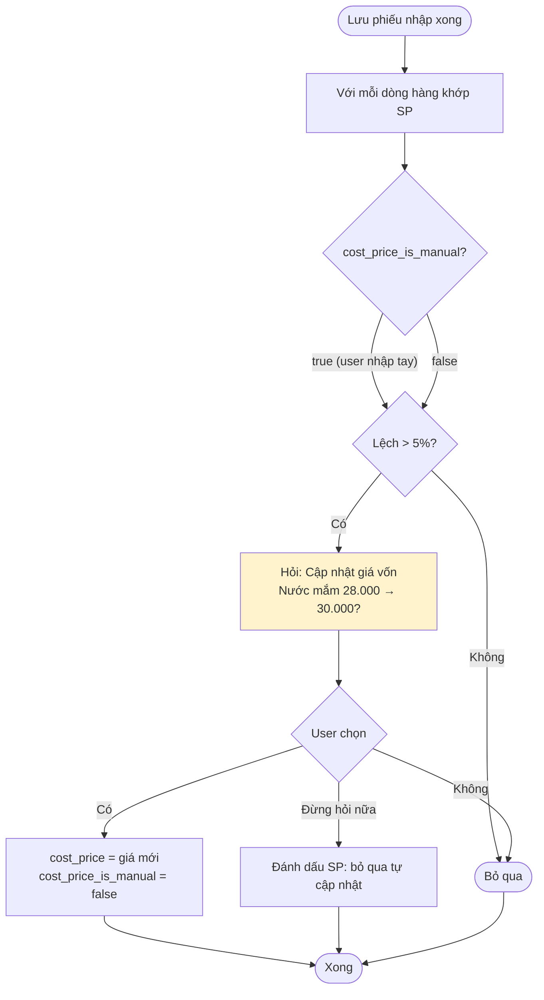

> **Không bao giờ ghi đè giá vốn user nhập tay mà không hỏi.**

---

## 8. F0.4 — Kết nối bot Zalo

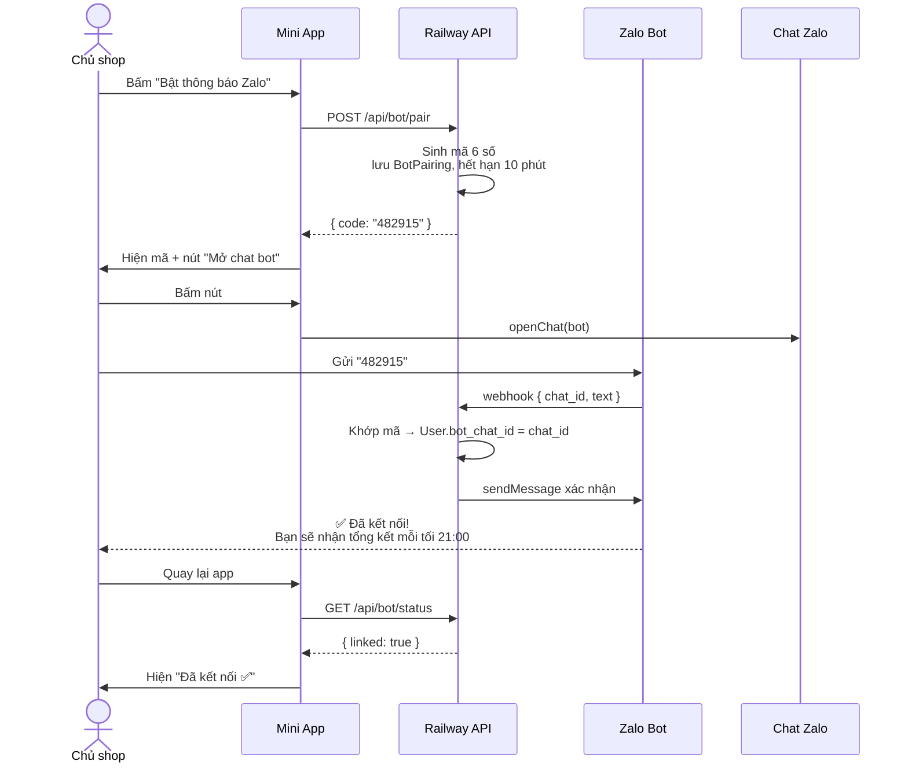

**Chưa kết nối thì sao?** App vẫn dùng bình thường, chỉ nhắc nhẹ ở dashboard. Nhưng luồng **xuất file bị chặn mềm** — xem mục 10.

---

## 9. F6 — Bot gửi thông báo định kỳ

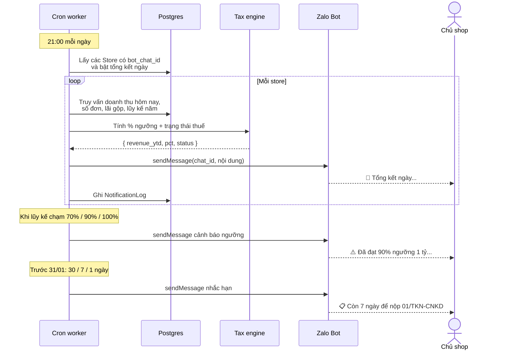

**Lịch thông báo:**

| Loại | Thời điểm |
|---|---|
| Tổng kết ngày | 21:00 (cấu hình được) |
| Tổng kết tháng | Ngày 1, 08:00 |
| Tổng kết quý | Ngày đầu quý sau, 08:00 |
| Cảnh báo ngưỡng | Ngay khi chạm 70% / 90% / 100% |
| Nhắc hạn 31/01 | Trước 30 / 7 / 1 ngày |

---

## 10. F4.5 & F5 — Xuất file qua bot

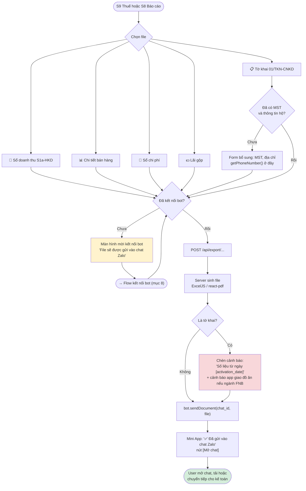

---

## 11. F5 — Màn hình Tình trạng thuế

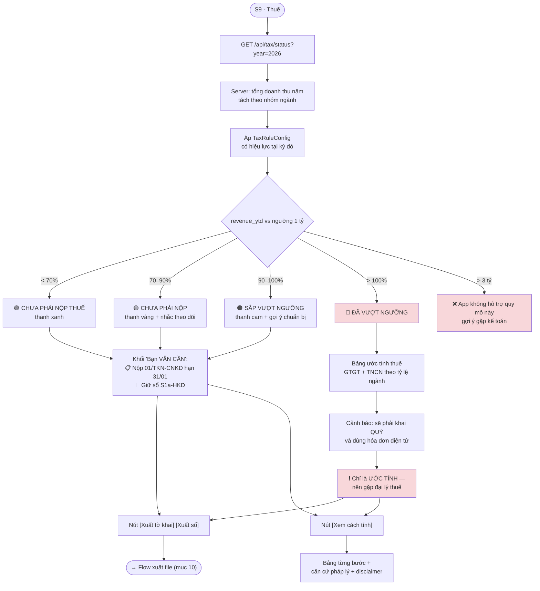

---

## 12. Trạng thái ngưỡng thuế trong năm

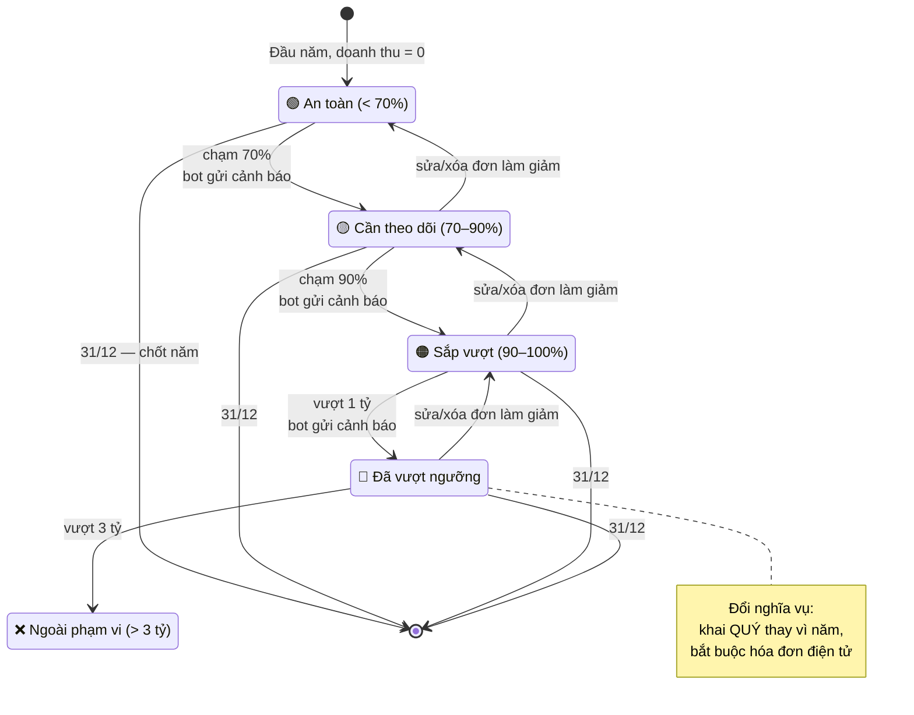

---

## 13. Trạng thái một đơn hàng khi mạng chập chờn

Vì kiến trúc **online-only**, đây là vòng đời cần làm cho thật kỹ.

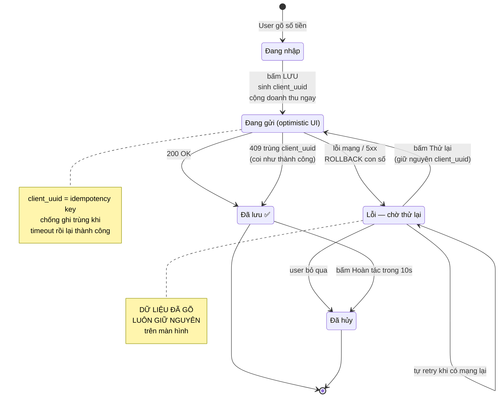

---

## 14. Vòng đời một năm thuế

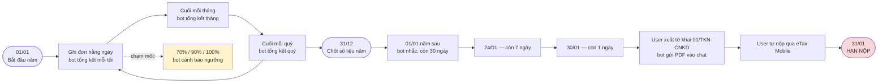

**Trường hợp đặc biệt — hộ mới thành lập trong năm:** nộp 2 lần, hạn 31/07 (6 tháng đầu) và 31/01 (6 tháng cuối). App phải tự nhận biết từ `Store.established_date`.

---

## 15. Lệnh bot — flow phụ không cần mở app

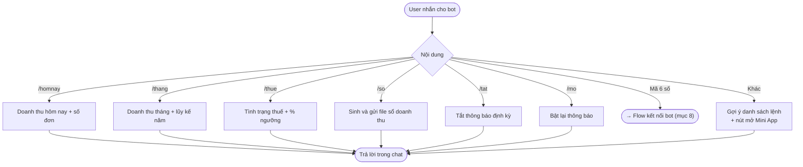

---

## 16. Ba luồng dễ làm ẩu nhất

| Luồng | Vì sao dễ hỏng | Bắt buộc |
|---|---|---|
| **Ghi đơn khi mạng yếu** (mục 3, 13) | Online-only nên mọi lỗi mạng đập thẳng vào user | Không bao giờ để mất dữ liệu đã gõ · nói thật về trạng thái · luôn có nút thoát |
| **Bản nháp giọng nói** (mục 4) | Cám dỗ tự lưu thẳng cho nhanh | Luôn qua bản nháp, kể cả khi model tự tin 100% |
| **Cảnh báo trên tờ khai** (mục 10) | Dễ quên vì không ai kiểm tra | Luôn in dòng "số liệu từ ngày X" và cảnh báo app giao đồ ăn |
